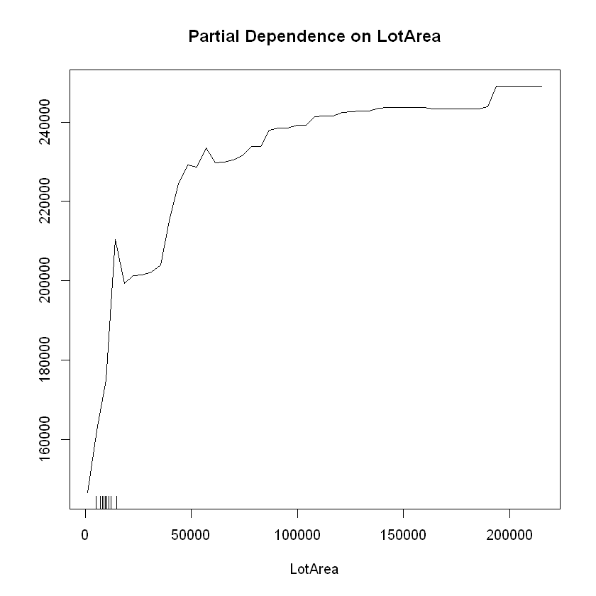
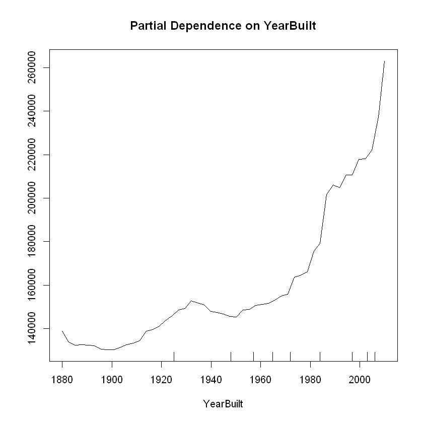
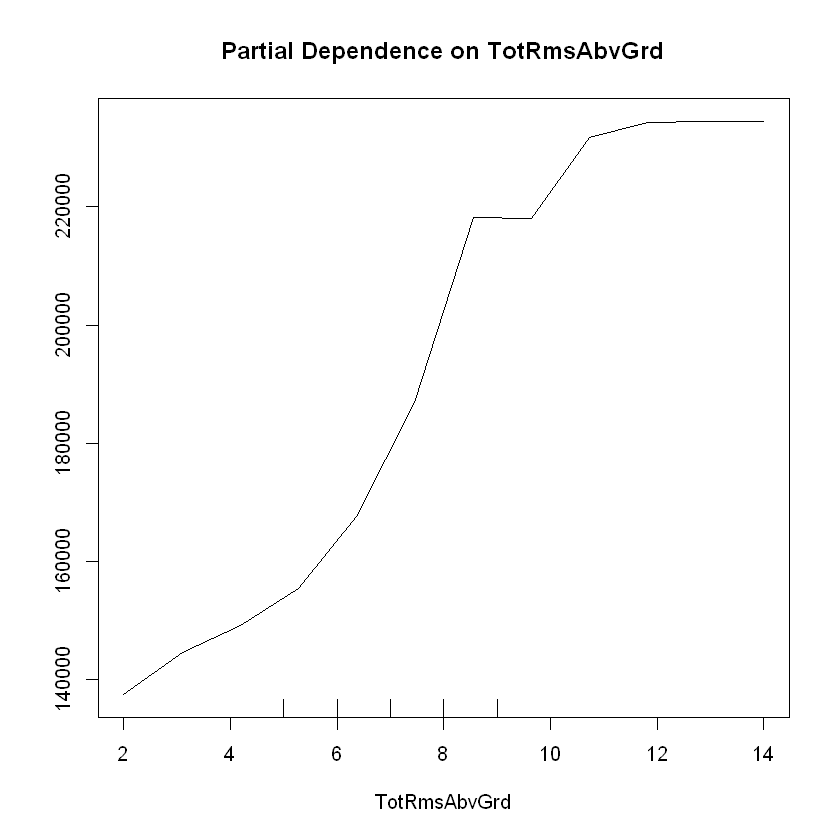

## *Learn Maching Learning* series on Kaggle in R

This is my R code for sections 3 and 4 of the level 2 part of the *Learn Machine Learning* series on Kaggle. I've already done the Python one, which is on Kaggle located [here](https://www.kaggle.com/learn/machine-learning). The data used is from the [*Home Prices: Advanced Regression Techniques*](https://www.kaggle.com/c/house-prices-advanced-regression-techniques) competition.

### Load and install packages and load the data


```R
# Install and load packages
# For random forests and partial dependence plots
if (!require("randomForest")) {
  install.packages("randomForest", repos="http://cran.rstudio.com/")
  library(randomForest)
} else {
  library(randomForest)
}

if (!require("dplyr")) {
  install.packages("dplyr", repos="http://cran.rstudio.com/")
  library(dplyr)
} else {
  library(dplyr)
}

if (!require("caTools")) {
  install.packages("caTools", repos="http://cran.rstudio.com/")
  library(caTools)
} else {
  library(caTools)
}

if (!require("rpart")) {
  install.packages("rpart", repos="http://cran.rstudio.com/")
  library(rpart)
} else {
  library(rpart)
}

if (!require("caret")) {
  install.packages("caret", repos="http://cran.rstudio.com/")
  library(rpart)
} else {
  library(rpart)
}

# For XGBoost
if (!require("xgboost")) {
  install.packages("xgboost", repos="http://cran.rstudio.com/")
  library(xgboost)
} else {
  library(xgboost)
}

# Save filepath to variable
training_data_filepath <- "C:/Development/Kaggle/House Prices - Advanced Regression Techniques/train.csv"

# Import data
dataset <- read.csv(training_data_filepath)
```

### XGBoost

I'm going to use XGBoost on the data, which requires some upfront work. The xgboost package is required to model with XGBoost.


```R
# Create the dataframe with only numeric predictors
nums <- unlist(lapply(dataset, is.numeric))
dataset_nums <- dataset[, nums]

# Create the dataframe with only categorical predictors
dataset_cat <- dataset[, !nums]

# Use dummyVars from the caret package to perform one-hot encoding
# on the categorical features
dummies <- dummyVars( ~ ., data=dataset_cat)
dataset_dummies <- as.data.frame(predict(dummies, newdata=dataset_cat))

# Impute missing numeric data using rfImpute
dataset_nums_impute <- rfImpute(SalePrice ~ ., dataset_nums)
```

         |      Out-of-bag   |
    Tree |      MSE  %Var(y) |
     300 | 8.414e+08    13.34 |
         |      Out-of-bag   |
    Tree |      MSE  %Var(y) |
     300 | 8.265e+08    13.10 |
         |      Out-of-bag   |
    Tree |      MSE  %Var(y) |
     300 | 8.571e+08    13.59 |
         |      Out-of-bag   |
    Tree |      MSE  %Var(y) |
     300 | 8.417e+08    13.35 |
         |      Out-of-bag   |
    Tree |      MSE  %Var(y) |
     300 | 8.877e+08    14.07 |
    

Combine the imputed and dummies datasets and view the top records


```R
dataset_combined <- cbind(dataset_nums_impute, dataset_dummies)
head(dataset_combined)
```


<table>
<thead><tr><th scope=col>SalePrice</th><th scope=col>Id</th><th scope=col>MSSubClass</th><th scope=col>LotFrontage</th><th scope=col>LotArea</th><th scope=col>OverallQual</th><th scope=col>OverallCond</th><th scope=col>YearBuilt</th><th scope=col>YearRemodAdd</th><th scope=col>MasVnrArea</th><th scope=col>...</th><th scope=col>SaleType.CWD</th><th scope=col>SaleType.New</th><th scope=col>SaleType.Oth</th><th scope=col>SaleType.WD</th><th scope=col>SaleCondition.Abnorml</th><th scope=col>SaleCondition.AdjLand</th><th scope=col>SaleCondition.Alloca</th><th scope=col>SaleCondition.Family</th><th scope=col>SaleCondition.Normal</th><th scope=col>SaleCondition.Partial</th></tr></thead>
<tbody>
	<tr><td>208500</td><td>1     </td><td>60    </td><td>65    </td><td> 8450 </td><td>7     </td><td>5     </td><td>2003  </td><td>2003  </td><td>196   </td><td>...   </td><td>0     </td><td>0     </td><td>0     </td><td>1     </td><td>0     </td><td>0     </td><td>0     </td><td>0     </td><td>1     </td><td>0     </td></tr>
	<tr><td>181500</td><td>2     </td><td>20    </td><td>80    </td><td> 9600 </td><td>6     </td><td>8     </td><td>1976  </td><td>1976  </td><td>  0   </td><td>...   </td><td>0     </td><td>0     </td><td>0     </td><td>1     </td><td>0     </td><td>0     </td><td>0     </td><td>0     </td><td>1     </td><td>0     </td></tr>
	<tr><td>223500</td><td>3     </td><td>60    </td><td>68    </td><td>11250 </td><td>7     </td><td>5     </td><td>2001  </td><td>2002  </td><td>162   </td><td>...   </td><td>0     </td><td>0     </td><td>0     </td><td>1     </td><td>0     </td><td>0     </td><td>0     </td><td>0     </td><td>1     </td><td>0     </td></tr>
	<tr><td>140000</td><td>4     </td><td>70    </td><td>60    </td><td> 9550 </td><td>7     </td><td>5     </td><td>1915  </td><td>1970  </td><td>  0   </td><td>...   </td><td>0     </td><td>0     </td><td>0     </td><td>1     </td><td>1     </td><td>0     </td><td>0     </td><td>0     </td><td>0     </td><td>0     </td></tr>
	<tr><td>250000</td><td>5     </td><td>60    </td><td>84    </td><td>14260 </td><td>8     </td><td>5     </td><td>2000  </td><td>2000  </td><td>350   </td><td>...   </td><td>0     </td><td>0     </td><td>0     </td><td>1     </td><td>0     </td><td>0     </td><td>0     </td><td>0     </td><td>1     </td><td>0     </td></tr>
	<tr><td>143000</td><td>6     </td><td>50    </td><td>85    </td><td>14115 </td><td>5     </td><td>5     </td><td>1993  </td><td>1995  </td><td>  0   </td><td>...   </td><td>0     </td><td>0     </td><td>0     </td><td>1     </td><td>0     </td><td>0     </td><td>0     </td><td>0     </td><td>1     </td><td>0     </td></tr>
</tbody>
</table>


#### Split the data set into training and test

This is simliar to before, using dataset_combined instead of dataset.


```R
# Split data into training and validation data, for both predictors and target.
set.seed(42)
split <- sample.split(dataset_combined, SplitRatio=0.7)  # for training data
training_set <- subset(dataset_combined, split==TRUE)
test_set <- subset(dataset_combined, split==FALSE)
```


```R
# Create X and y from the training and test sets
X_train <- training_set %>%
    select(-c(Id, SalePrice))
X_test <- test_set %>%
    select(-c(Id, SalePrice))
y_train <- training_set$SalePrice
y_test <- test_set$SalePrice
```

#### Create the XGBoost model and predict values


```R
xgb <- xgboost(data.matrix(X_train), y_train, nrounds=25, verbose=0)
y_pred <- predict(xgb, data.matrix(X_test))
```


```R
# Create an MAE function to get the Mean Absolute Error
mae <- function(error)
{
  mean(abs(error))
}

error <- y_pred - y_test

mae(error)
```


19779.9675398633


```R
# Create a function to get the MAE of XGBoost nround values
getMae_xgb <- function(X_train, y_train, X_test, y_test, n) {
  set.seed(42)
  xgb <- xgboost(data.matrix(X_train), y_train, nrounds=n, verbose=0)
  y_pred <- predict(xgb, data.matrix(X_test))
  error <- (y_pred - y_test)
  print(paste("nround of ", n, " has an MAE of ", mae(error), sep=""))
}

# Loop through multiple nround values
nrounds = c(1, 5, 10, 30, 50, 100, 500, 1000, 5000)

for (i in nrounds) {
  getMae_xgb(X_train, y_train, X_test, y_test, i)
}
```

    [1] "nround of 1 has an MAE of 136694.404586062"
    [1] "nround of 5 has an MAE of 39075.4283438924"
    [1] "nround of 10 has an MAE of 21415.4554207005"
    [1] "nround of 30 has an MAE of 19772.0597238041"
    [1] "nround of 50 has an MAE of 19694.1839763667"
    [1] "nround of 100 has an MAE of 19637.0124928815"
    [1] "nround of 500 has an MAE of 19621.2550363041"
    [1] "nround of 1000 has an MAE of 19621.2714977221"
    [1] "nround of 5000 has an MAE of 19621.4138667426"
    

nround of 500 has the lowest MAE but it isn't much better than 100 and even 50. These different nround values take some time to run and the higher values don't seem to make much of a difference with this dataset. There are other parameters I can tune and may try at a later date and those could make more of a difference than the higher nround values.

### Partial Dependence Plots

Partial Dependence Plots in R can be done using partialPlot function available in the randomForest package.


```R
# Split data into training and validation data, for both predictors and target.
set.seed(42)
split <- sample.split(dataset, SplitRatio=0.7)  # for training data
training_set <- subset(dataset, split==TRUE)
test_set <- subset(dataset, split==FALSE)

# Create the training and tests dataframe with only a few selected predicted variables
predictors <- c("LotArea", "YearBuilt", "TotRmsAbvGrd", "SalePrice")
training_set_preds <- training_set[, predictors]
test_set_preds <- test_set[, predictors]

# Create the predictor variable
X <- subset(training_set_preds, select = -SalePrice)

# Select the target variable and call it y
y <- training_set_preds$SalePrice

# Fit Random Forest regression to the dataset and predict a new result
regressor <- randomForest(x=X, y=y, ntree=500)
y_prediction <- predict(regressor, newdata=subset(test_set_preds, select = -SalePrice))
```


```R
# Partial Dependence Plot with LotArea
partialPlot(regressor, X, LotArea)
```





```R
# Partial Dependence Plot with YearBuilt
partialPlot(regressor, X, YearBuilt)
```





```R
# Partial Dependence Plot with TotRmsAbvGrd
partialPlot(regressor, X, TotRmsAbvGrd)
```





SalePrice generally increases as LotArea, YearBuilt, and TotRmsAbvGrd increase, though there is a leveling off between 8 to 10 rooms above ground.

### Next steps

I'm going to work on the next few sections. I still have Cross Validation, Data Leakage, and Pipelines yet to figure out and then code. I'm not sure yet how to do those so I'll keep researching and learning!
